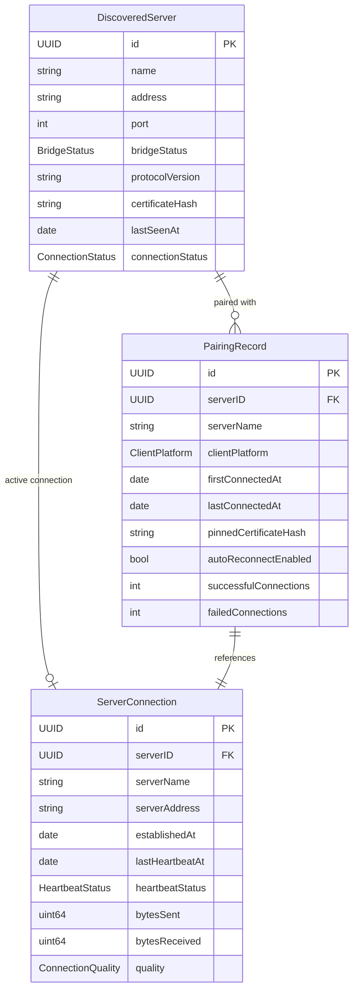

# Data Model: LAN Auto-Discovery

**Feature**: 001-lan-auto-discovery
**Date**: 2025-11-23
**Status**: Complete

## Overview

This document defines the domain entities and their relationships for the LAN auto-discovery feature. All entities are designed as pure Swift value types conforming to `Sendable` for Swift 6 strict concurrency compliance.

---

## Domain Entities

### 1. DiscoveredServer

Represents a Liuli-Server instance discovered on the local network via mDNS/DNS-SD.

**Location**: `Domain/Entities/DiscoveredServer.swift`

```swift
import Foundation

/// Represents a discovered Liuli-Server instance on the local network
public struct DiscoveredServer: Identifiable, Sendable, Equatable, Hashable {
    /// Unique identifier (matches server's device UUID)
    public let id: UUID

    /// User-facing device name (e.g., "John's MacBook Pro")
    public let name: String

    /// Server's local IP address
    public let address: String

    /// SOCKS5 proxy port
    public let port: Int

    /// Current bridge status
    public let bridgeStatus: BridgeStatus

    /// Protocol version (for compatibility checking)
    public let protocolVersion: String

    /// SHA-256 hash of server's certificate SPKI (for TOFU)
    public let certificateHash: String

    /// When this server was last seen (for timeout detection)
    public let lastSeenAt: Date

    /// Current connection status from client perspective
    public let connectionStatus: ConnectionStatus

    public init(
        id: UUID,
        name: String,
        address: String,
        port: Int,
        bridgeStatus: BridgeStatus,
        protocolVersion: String,
        certificateHash: String,
        lastSeenAt: Date = .now,
        connectionStatus: ConnectionStatus = .disconnected
    ) {
        self.id = id
        self.name = name
        self.address = address
        self.port = port
        self.bridgeStatus = bridgeStatus
        self.protocolVersion = protocolVersion
        self.certificateHash = certificateHash
        self.lastSeenAt = lastSeenAt
        self.connectionStatus = connectionStatus
    }
}

public extension DiscoveredServer {
    enum BridgeStatus: String, Sendable, Codable {
        case active
        case inactive
    }

    enum ConnectionStatus: Sendable, Equatable {
        case disconnected
        case connecting
        case connected
        case failed(reason: String)
    }

    /// Check if server has timed out (no broadcast for 15+ seconds)
    var isTimedOut: Bool {
        Date.now.timeIntervalSince(lastSeenAt) > 15.0
    }

    /// Check if server is connectable
    var isConnectable: Bool {
        bridgeStatus == .active && !isTimedOut
    }
}
```

**Validation Rules**:
- `port` must be in range 1024-65535
- `address` must be valid IPv4 or IPv6 address
- `protocolVersion` follows semver (e.g., "1.0.0")
- `certificateHash` is 64-character hex string (SHA-256)

**State Transitions**:
```
disconnected → connecting → connected
               ↓
            failed → disconnected
```

---

### 2. PairingRecord

Represents historical connection between a mobile device and a Liuli-Server, used for auto-reconnection.

**Location**: `Domain/Entities/PairingRecord.swift`

```swift
import Foundation

/// Historical pairing record for auto-reconnection
public struct PairingRecord: Identifiable, Sendable, Equatable {
    /// Unique record identifier
    public let id: UUID

    /// Server's device UUID (matches DiscoveredServer.id)
    public let serverID: UUID

    /// Server's device name at time of pairing
    public let serverName: String

    /// Client platform (for analytics/debugging)
    public let clientPlatform: ClientPlatform

    /// When this pairing was first established
    public let firstConnectedAt: Date

    /// When this server was last connected
    public let lastConnectedAt: Date

    /// Pinned certificate SPKI hash (for TOFU validation)
    public let pinnedCertificateHash: String

    /// User preference: auto-reconnect to this server
    public let autoReconnectEnabled: Bool

    /// Connection success count (for reliability metrics)
    public let successfulConnections: Int

    /// Connection failure count (for reliability metrics)
    public let failedConnections: Int

    public init(
        id: UUID = UUID(),
        serverID: UUID,
        serverName: String,
        clientPlatform: ClientPlatform,
        firstConnectedAt: Date = .now,
        lastConnectedAt: Date = .now,
        pinnedCertificateHash: String,
        autoReconnectEnabled: Bool = true,
        successfulConnections: Int = 1,
        failedConnections: Int = 0
    ) {
        self.id = id
        self.serverID = serverID
        self.serverName = serverName
        self.clientPlatform = clientPlatform
        self.firstConnectedAt = firstConnectedAt
        self.lastConnectedAt = lastConnectedAt
        self.pinnedCertificateHash = pinnedCertificateHash
        self.autoReconnectEnabled = autoReconnectEnabled
        self.successfulConnections = successfulConnections
        self.failedConnections = failedConnections
    }
}

public extension PairingRecord {
    enum ClientPlatform: String, Sendable, Codable {
        case iOS = "iOS"
        case android = "Android"
    }

    /// Check if record should be purged (30+ days old)
    var shouldPurge: Bool {
        let age = Date.now.timeIntervalSince(lastConnectedAt)
        return age > (30 * 24 * 60 * 60)  // 30 days in seconds
    }

    /// Update with successful connection
    func recordSuccess() -> PairingRecord {
        PairingRecord(
            id: id,
            serverID: serverID,
            serverName: serverName,
            clientPlatform: clientPlatform,
            firstConnectedAt: firstConnectedAt,
            lastConnectedAt: .now,
            pinnedCertificateHash: pinnedCertificateHash,
            autoReconnectEnabled: autoReconnectEnabled,
            successfulConnections: successfulConnections + 1,
            failedConnections: failedConnections
        )
    }

    /// Update with failed connection
    func recordFailure() -> PairingRecord {
        PairingRecord(
            id: id,
            serverID: serverID,
            serverName: serverName,
            clientPlatform: clientPlatform,
            firstConnectedAt: firstConnectedAt,
            lastConnectedAt: lastConnectedAt,
            pinnedCertificateHash: pinnedCertificateHash,
            autoReconnectEnabled: autoReconnectEnabled,
            successfulConnections: successfulConnections,
            failedConnections: failedConnections + 1
        )
    }

    /// Calculate reliability percentage
    var reliabilityPercentage: Double {
        let total = successfulConnections + failedConnections
        guard total > 0 else { return 0 }
        return Double(successfulConnections) / Double(total) * 100
    }
}
```

**Lifecycle**:
- Created on first successful connection
- Updated on each connection attempt (success/failure)
- Auto-purged after 30 days of inactivity
- User can manually delete via "Forget Server" action

---

### 3. ServerConnection

Represents an active VPN connection between mobile device and Liuli-Server.

**Location**: `Domain/Entities/ServerConnection.swift`

```swift
import Foundation

/// Active VPN connection to a Liuli-Server
public struct ServerConnection: Identifiable, Sendable, Equatable {
    /// Unique connection identifier
    public let id: UUID

    /// Connected server's device UUID
    public let serverID: UUID

    /// Server name for display
    public let serverName: String

    /// Server address
    public let serverAddress: String

    /// Connection establishment timestamp
    public let establishedAt: Date

    /// Last heartbeat received timestamp
    public let lastHeartbeatAt: Date

    /// Current heartbeat status
    public let heartbeatStatus: HeartbeatStatus

    /// Total bytes sent through tunnel
    public let bytesSent: UInt64

    /// Total bytes received through tunnel
    public let bytesReceived: UInt64

    /// Connection quality indicator
    public let quality: ConnectionQuality

    public init(
        id: UUID = UUID(),
        serverID: UUID,
        serverName: String,
        serverAddress: String,
        establishedAt: Date = .now,
        lastHeartbeatAt: Date = .now,
        heartbeatStatus: HeartbeatStatus = .healthy,
        bytesSent: UInt64 = 0,
        bytesReceived: UInt64 = 0,
        quality: ConnectionQuality = .good
    ) {
        self.id = id
        self.serverID = serverID
        self.serverName = serverName
        self.serverAddress = serverAddress
        self.establishedAt = establishedAt
        self.lastHeartbeatAt = lastHeartbeatAt
        self.heartbeatStatus = heartbeatStatus
        self.bytesSent = bytesSent
        self.bytesReceived = bytesReceived
        self.quality = quality
    }
}

public extension ServerConnection {
    enum HeartbeatStatus: Sendable, Equatable {
        case healthy
        case degraded  // Missed 1-2 heartbeats
        case failing   // Missed 3+ heartbeats
        case lost      // No heartbeat for 90+ seconds
    }

    enum ConnectionQuality: Sendable, Equatable {
        case excellent  // Latency < 10ms
        case good       // Latency 10-50ms
        case fair       // Latency 50-100ms
        case poor       // Latency > 100ms
    }

    /// Connection duration in seconds
    var duration: TimeInterval {
        Date.now.timeIntervalSince(establishedAt)
    }

    /// Time since last heartbeat in seconds
    var timeSinceLastHeartbeat: TimeInterval {
        Date.now.timeIntervalSince(lastHeartbeatAt)
    }

    /// Check if connection should be considered dead
    var isDead: Bool {
        timeSinceLastHeartbeat > 90.0  // 90 seconds = 3x heartbeat interval
    }

    /// Format traffic stats for display
    var formattedTraffic: String {
        let sent = ByteCountFormatter.string(fromByteCount: Int64(bytesSent), countStyle: .binary)
        let received = ByteCountFormatter.string(fromByteCount: Int64(bytesReceived), countStyle: .binary)
        return "↑\(sent) ↓\(received)"
    }
}
```

**State Transitions**:
```
healthy → degraded → failing → lost
  ↑         ↑         ↑
  └─────────┴─────────┘ (recovery on heartbeat)
```

---

### 4. ServiceBroadcast (Server-Side Only)

Represents the mDNS service broadcast configuration on the server.

**Location**: `Domain/Entities/ServiceBroadcast.swift`

```swift
import Foundation

/// Configuration for mDNS/DNS-SD service broadcast
public struct ServiceBroadcast: Sendable, Equatable {
    /// Service type (always "_liuli-proxy._tcp.")
    public let serviceType: String

    /// Service domain (always "local.")
    public let domain: String

    /// Server device name (from hostname)
    public let deviceName: String

    /// Server unique identifier
    public let deviceID: UUID

    /// SOCKS5 proxy port
    public let port: Int

    /// Current bridge status
    public let bridgeStatus: BridgeStatus

    /// Protocol version
    public let protocolVersion: String

    /// Certificate SPKI hash (for TOFU)
    public let certificateHash: String

    /// Broadcast interval in seconds
    public let broadcastInterval: TimeInterval

    public init(
        serviceType: String = "_liuli-proxy._tcp.",
        domain: String = "local.",
        deviceName: String,
        deviceID: UUID,
        port: Int,
        bridgeStatus: BridgeStatus,
        protocolVersion: String = "1.0.0",
        certificateHash: String,
        broadcastInterval: TimeInterval = 5.0
    ) {
        self.serviceType = serviceType
        self.domain = domain
        self.deviceName = deviceName
        self.deviceID = deviceID
        self.port = port
        self.bridgeStatus = bridgeStatus
        self.protocolVersion = protocolVersion
        self.certificateHash = certificateHash
        self.broadcastInterval = broadcastInterval
    }

    public enum BridgeStatus: String, Sendable, Codable {
        case active
        case inactive
    }

    /// Generate TXT record dictionary for NetService
    public var txtRecord: [String: String] {
        [
            "port": "\(port)",
            "version": protocolVersion,
            "device_id": deviceID.uuidString,
            "bridge_status": bridgeStatus.rawValue,
            "cert_hash": certificateHash
        ]
    }

    /// Full service name for mDNS
    public var serviceName: String {
        "\(serviceType)\(domain)"
    }
}
```

---

## Data Layer Models (SwiftData)

### PairingRecordModel (macOS Server)

Persistent storage model for pairing history on the server.

**Location**: `Data/Models/PairingRecordModel.swift`

```swift
import Foundation
import SwiftData

@Model
final class PairingRecordModel {
    @Attribute(.unique) var id: UUID
    var serverID: UUID
    var serverName: String
    var clientPlatform: String
    var firstConnectedAt: Date
    var lastConnectedAt: Date
    var pinnedCertificateHash: String
    var autoReconnectEnabled: Bool
    var successfulConnections: Int
    var failedConnections: Int

    init(
        id: UUID,
        serverID: UUID,
        serverName: String,
        clientPlatform: String,
        firstConnectedAt: Date,
        lastConnectedAt: Date,
        pinnedCertificateHash: String,
        autoReconnectEnabled: Bool,
        successfulConnections: Int,
        failedConnections: Int
    ) {
        self.id = id
        self.serverID = serverID
        self.serverName = serverName
        self.clientPlatform = clientPlatform
        self.firstConnectedAt = firstConnectedAt
        self.lastConnectedAt = lastConnectedAt
        self.pinnedCertificateHash = pinnedCertificateHash
        self.autoReconnectEnabled = autoReconnectEnabled
        self.successfulConnections = successfulConnections
        self.failedConnections = failedConnections
    }
}

// Mapping between Domain and Data layers
extension PairingRecordModel {
    func toDomain() -> PairingRecord {
        PairingRecord(
            id: id,
            serverID: serverID,
            serverName: serverName,
            clientPlatform: PairingRecord.ClientPlatform(rawValue: clientPlatform) ?? .iOS,
            firstConnectedAt: firstConnectedAt,
            lastConnectedAt: lastConnectedAt,
            pinnedCertificateHash: pinnedCertificateHash,
            autoReconnectEnabled: autoReconnectEnabled,
            successfulConnections: successfulConnections,
            failedConnections: failedConnections
        )
    }

    static func fromDomain(_ record: PairingRecord) -> PairingRecordModel {
        PairingRecordModel(
            id: record.id,
            serverID: record.serverID,
            serverName: record.serverName,
            clientPlatform: record.clientPlatform.rawValue,
            firstConnectedAt: record.firstConnectedAt,
            lastConnectedAt: record.lastConnectedAt,
            pinnedCertificateHash: record.pinnedCertificateHash,
            autoReconnectEnabled: record.autoReconnectEnabled,
            successfulConnections: record.successfulConnections,
            failedConnections: record.failedConnections
        )
    }
}
```

---

## Entity Relationships



---

## Data Validation

### DiscoveredServer
- `port`: 1024 ≤ port ≤ 65535
- `address`: Valid IPv4 (regex: `^\d{1,3}\.\d{1,3}\.\d{1,3}\.\d{1,3}$`) or IPv6
- `certificateHash`: 64 hex characters (SHA-256)
- `protocolVersion`: Semver format (e.g., "1.0.0")

### PairingRecord
- `pinnedCertificateHash`: 64 hex characters (SHA-256)
- `firstConnectedAt` ≤ `lastConnectedAt`
- `successfulConnections` ≥ 0
- `failedConnections` ≥ 0

### ServerConnection
- `establishedAt` ≤ `lastHeartbeatAt`
- `bytesSent` ≥ 0
- `bytesReceived` ≥ 0
- `timeSinceLastHeartbeat` ≥ 0

---

## Serialization

All domain entities support JSON encoding/decoding for testing and debugging:

```swift
extension DiscoveredServer: Codable {}
extension PairingRecord: Codable {}
extension ServerConnection: Codable {}
extension ServiceBroadcast: Codable {}
```

**Example JSON** (DiscoveredServer):
```json
{
  "id": "550e8400-e29b-41d4-a716-446655440000",
  "name": "John's MacBook Pro",
  "address": "192.168.1.100",
  "port": 9050,
  "bridgeStatus": "active",
  "protocolVersion": "1.0.0",
  "certificateHash": "A1B2C3D4E5F6...",
  "lastSeenAt": "2025-11-23T10:30:00Z",
  "connectionStatus": "disconnected"
}
```

---

## Migration Strategy

### Version 1.0.0 → 1.1.0
If protocol changes (e.g., add new TXT record field):
1. Add new field with default value
2. Update `protocolVersion` in ServiceBroadcast
3. Clients check version compatibility before connecting
4. Graceful fallback for older servers

### SwiftData Schema Updates
- Use `@Attribute(.unique)` for `id` fields
- Add new fields with default values
- Remove deprecated fields via staged migration

---

**Document Status**: ✅ Complete - All domain entities defined
**Next**: Generate API contracts (mDNS, heartbeat, TOFU protocols)
